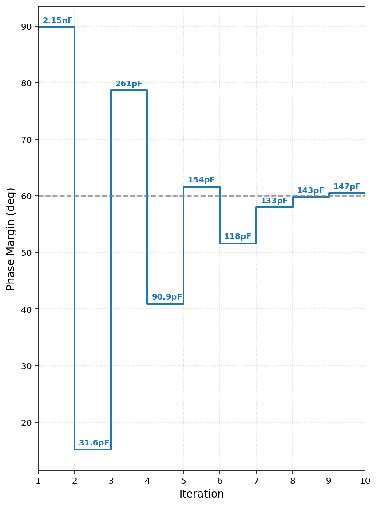

# pyTIA
tool for automatic selection of compensating capacitor in transimpedance amplifier circuits


## Introduction
Compensated transimpedance ampifier system can be simplified to a second degree system with two poles and one zero.

This circuit optimizes the capacitor value for a given Rf value in order to match the specified PM (usually 60deg) and selects the closest capacitor from a predetermined E series that statisfies the condition.


## Example usage
Example code:
```
import pyTIAmodule as tia

# OA parameters
Ao_db = 115
GBW = 20e6

# photodiode parameters
Cs = 35e-9

# feedback parameters
Rf_arr = [20_000] # ohm
Cf_min = 470e-15  # 470fF
Cf_max = 10e-6  # 10uF

# change dB to lin gain
Ao_lin = tia.Ao_db_to_lin(Ao_db)

# generate capacitors based on the available series
# cap series: E3(20%) E6(20%) E12(10%) E24(5%) E48(2%) E96 (1%) E192(±0.5%, ±0.25%, ±0.1%)
e96_base = tia.generate_e_series_bases(96)
Cf_list = tia.generate_capacitors(e96_base, Cf_min, Cf_max)

f, s = tia.generate_f_vector(fmin=1, fmax=1e9, decpoints=20) # 1Hz to 1GHz
tia.find_best_Cf(f, s, Ao_lin, GBW, Cs, Rf_arr, Cf_list, target_PM=60)
```

Example output:
```
running for 20000 ohms
for 2150.00pF PM=89.84 -> DOWN
for 31.60pF PM=15.15 -> UP
for 261.00pF PM=78.68 -> DOWN
for 90.90pF PM=40.92 -> UP
for 154.00pF PM=61.61 -> DOWN
for 118.00pF PM=51.62 -> UP
for 133.00pF PM=57.95 -> UP
for 143.00pF PM=59.79 -> UP
for 147.00pF PM=60.48 -> DOWN
BEST: 
Rf: 20000 ohms   Cf: 147.00 pF   PM: 60.47804852699646deg
```




## Integration with other tools

This tool can be integrated with other lookup table-based approaches (such as the gm/ID technique) and Python-compatible tools ([pygmid](https://github.com/dreoilin/pygmid)) to further automate the design process of analog circuits.


## Useful links:

[pygmid GitHub repo](https://github.com/dreoilin/pygmid)

Expansion for: [TIA-stability-analysis](https://github.com/kszdomagh/TIA-stability-analysis)

[Texas Instruments - What You Need to Know about Transimpedance Amplifiers](https://www.ti.com/lit/ta/ssztbc4/ssztbc4.pdf?ts=1770103794839)

[Analog Devices - Stabilize Your Transimpedance Amplifier](https://www.analog.com/en/resources/technical-articles/stabilize-transimpedance-amplifier-circuit-design.html)
